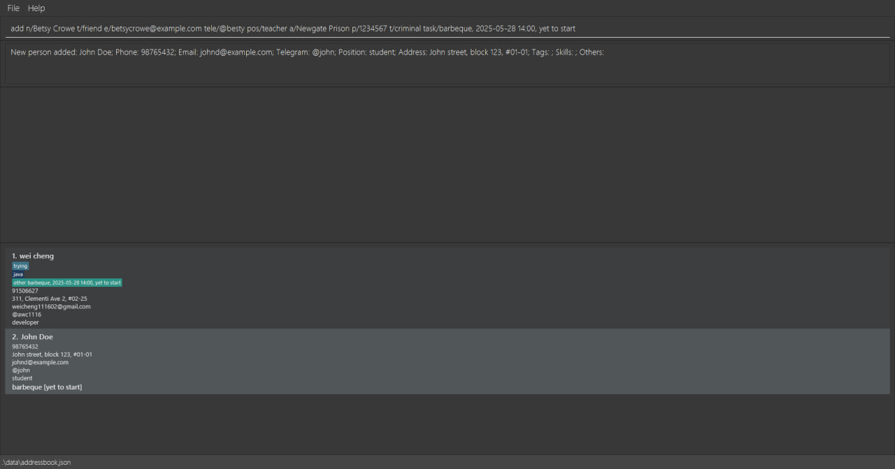
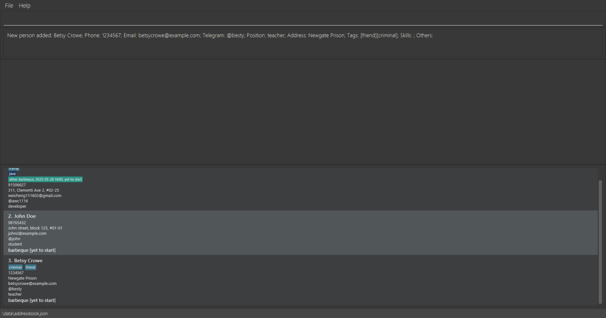
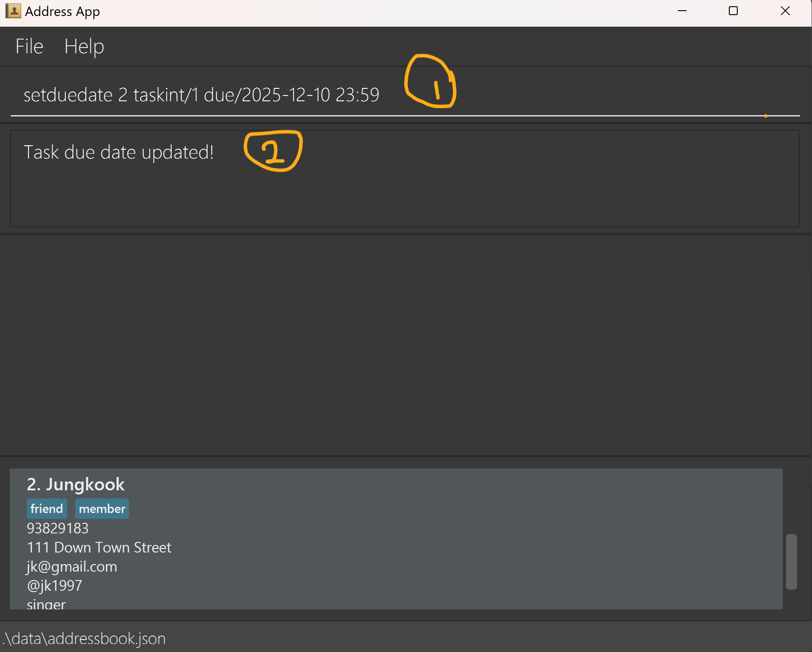
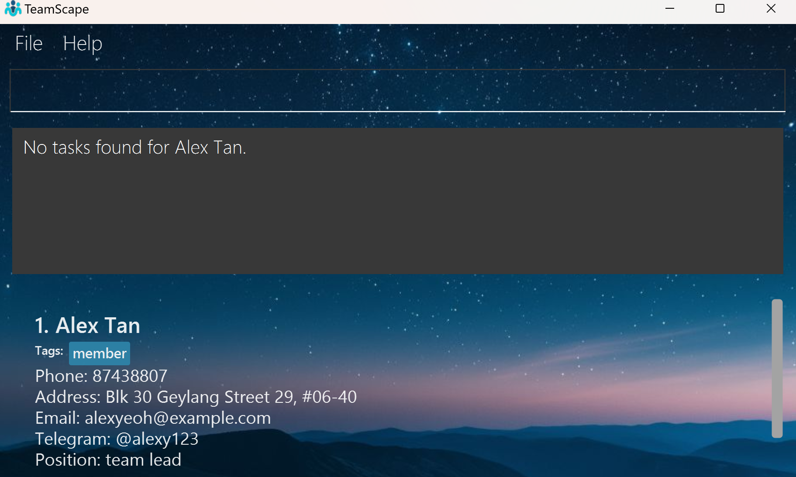
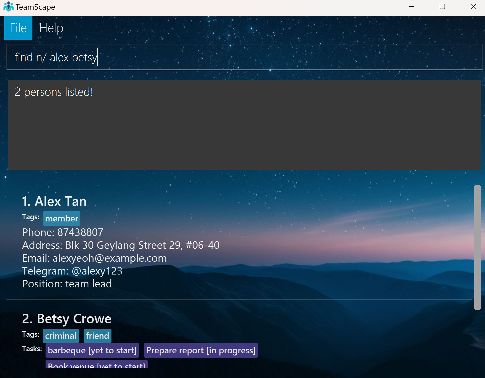
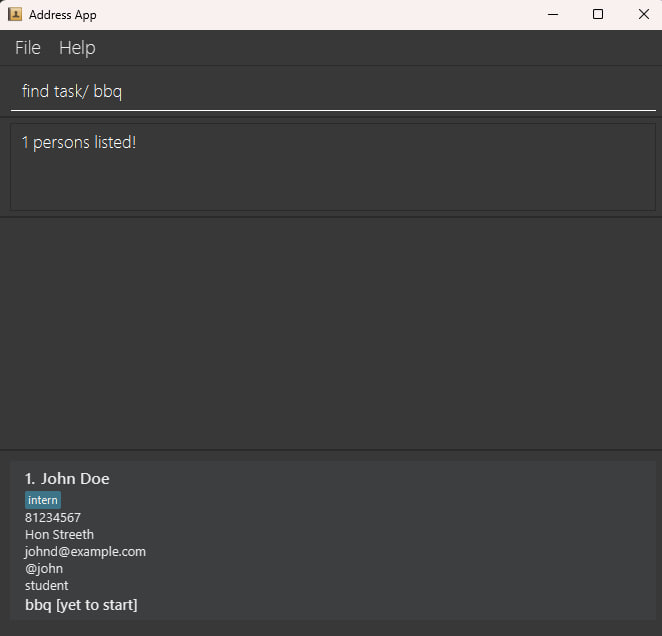
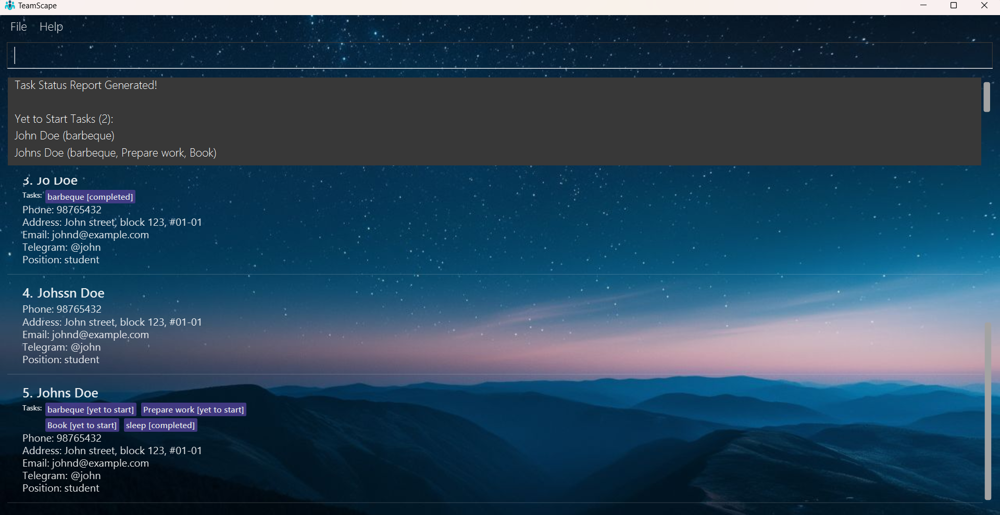

<!--
  layout: default.md
  title: "User Guide"
  pageNav: 3
-->

# TeamScape User Guide

AddressBook Level 3 (AB3) is a **desktop app for managing contacts and the tasks under it, optimized for use via a Command Line Interface** (CLI) while still having the benefits of a Graphical User Interface (GUI). If you can type fast, TeamScape can get your contact/task management tasks done faster than traditional GUI apps. Adopted from AB3.

<!-- * Table of Contents -->
## Table of Contents
1. [Quick Start](#quick-start)
2. [Features](#features)
    - [Viewing Help](#viewing-help--help)
    - [Adding a Person](#adding-a-person-add)
    - [Adding a Task to a Member](#adding-a-task-to-a-member-task)
    - [Listing All Persons](#listing-all-persons--list)
    - [Editing a Person](#editing-a-person--edit)
    - [Setting Due Date for a Task](#setting-due-date-for-a-task--setduedate)
    - [Listing Tasks Assigned to a Member](#listing-tasks-assigned-to-a-member--listtasks)
    - [Deleting a Task Under a Member](#deleting-a-task-under-a-member--deltask)
    - [Updating Status for a Task](#updating-status-for-a-task--mark)
    - [Locating Persons by Name, Tags, or Tasks](#locating-persons-by-name-tags-or-tasks-find)
    - [Generate Task Status Report](#generate-task-status-report--report)
    - [Deleting a Person](#deleting-a-person--delete)
    - [Clearing All Entries](#clearing-all-entries--clear)
    - [Exiting the Program](#exiting-the-program--exit)
    - [Saving the Data](#saving-the-data)
    - [Editing the Data File](#editing-the-data-file)
3. [FAQ](#faq)
4. [Known Issues](#known-issues)
5. [Command Summary](#command-summary)

--------------------------------------------------------------------------------------------------------------------

## Quick start

1. Ensure you have Java `17` or above installed in your Computer. 
   **Mac users:** Ensure you have the precise JDK version prescribed [here](https://se-education.org/guides/tutorials/javaInstallationMac.html).

2. Download the latest `.jar` file from [here](https://github.com/AY2425S2-CS2103-F09-4/tp/releases).

3. Copy the file to the folder you want to use as the _home folder_ for your AddressBook.

4. Open a command terminal, `cd` into the folder you put the jar file in, and use the `java -jar addressbook.jar` command to run the application. 
   A GUI similar to the below should appear in a few seconds. Note how the app contains some sample data. 
   

5. Type the command in the command box and press Enter to execute it. e.g. typing **`help`** and pressing Enter will open the help window. 
   Some example commands you can try:

   * `list` : Lists all contacts.

   * `add n/John Doe p/98765432 e/johnd@example.com tele/@john pos/student a/John street, block 123, #01-01` : Adds a contact named `John Doe` to the Address Book.

   * `delete 3` : Deletes the 3rd contact shown in the current list.

   * `clear` : Deletes all contacts.

   * `exit` : Exits the app.

6. Refer to the [Features](#features) below for details of each command.

--------------------------------------------------------------------------------------------------------------------

## Features

**Notes about the command format:** 

* Words in `UPPER_CASE` are the parameters to be supplied by the user. 
  e.g. in `add n/NAME`, `NAME` is a parameter which can be used as `add n/John Doe`.

* Items in square brackets are optional. 
  e.g `n/NAME [t/TAG]` can be used as `n/John Doe t/friend` or as `n/John Doe`.

* Items with `…`​ after them can be used multiple times including zero times. 
  e.g. `[t/TAG]…​` can be used as ` ` (i.e. 0 times), `t/friend`, `t/friend t/family` etc.

* Parameters can be in any order, unless specified by the particular command. 
  e.g. if the command specifies `n/NAME p/PHONE_NUMBER`, `p/PHONE_NUMBER n/NAME` is also acceptable.

* Extraneous parameters for commands that do not take in parameters (such as `help`, `list`, `exit` and `clear`) will be ignored. 
  e.g. if the command specifies `help 123`, it will be interpreted as `help`.

* If you are using a PDF version of this document, be careful when copying and pasting commands that span multiple lines as space characters surrounding line-breaks may be omitted when copied over to the application.
</box>

### Viewing help : `help`

Shows a message explaining how to access the help page.

Format: `help`

### Adding a person: `add`

Adds a person to the address book.

Format: `add n/NAME p/PHONE_NUMBER e/EMAIL tele/TELEGRAM pos/POSITION a/ADDRESS [t/TAG]…​ [s/SKILL]…​ [o/OTHER]…​ [task/TASK]…​`

**Note:** 
- Task can have no due date and status (ie task/barbeque or task/barbeque, 2025-05-28 14:00 or task/barbeque, in progress) the default status would be yet to start.
- Repeated names are treated as the same person, regardless of case or other details, and will not be added again. 
- A person can have any number of tags, skills, others and tasks (including 0). See "Adding a task to a member" section for more information regarding task creation.

Examples:
* `add n/John Doe p/98765432 e/johnd@example.com tele/@john pos/student a/John street, block 123, #01-01 task/barbeque, 2025-05-28 14:00, yet to start`
* `add n/Betsy Crowe t/friend e/betsycrowe@example.com tele/@besty pos/teacher a/Newgate Prison p/12345678 t/criminal task/barbeque, 2025-05-28 14:00, yet to start`
  

  

### Adding a task to a member: `task`

Adds a task to the specified member.

Format: `task PERSON_INDEX task/TASK_DESCRIPTION[, DUE_DATE[, TASK_STATUS]`

**Note:**
- Task description is mandatory.
- Task Status can be one of: `yet to start`, `in progress`, `completed`.
- Date and task status are optional. If omitted, status defaults to `yet to start`.
- All task details must be separated by commas `,` in the correct order: description, due date (if any), 
and then status (if any).
- There can only exist 1 task with a unique task description. 
In other words, another task with the same description cannot be added.
- There can only exist 1 `task/` prefix for each TaskCommand to be added.
- When only 1 task field is provided (e.g. `completed`), and it matches with a valid task status or due date format, 
it will be interpreted strictly as such regardless of the intention.

**Limitations:**
- When invalid date format is provided for the task description field, it is accepted as valid as there is no restriction of
  input standardisation.
- When there exists multiple errors with the command input by the user, the error message will only show up one by one at a time.

**Related:**
- See "Setting due date for a task" section for more information on due dates.

Examples:
* `task 3 task/Prepare report, 2025-10-10 10:00, in progress`
* `task 3 task/Book venue`
  

### Listing all persons : `list`

Shows a list of all persons in the address book.

Format: `list`

### Editing a person : `edit`

Edits an existing person in the address book.

Format: `edit INDEX n/NAME p/PHONE_NUMBER e/EMAIL tele/TELEGRAM pos/POSITION a/ADDRESS [t/TAG]…​ [s/SKILL]…​ [o/OTHER]…​ [task/TASK]…​`

* Edits the person at the specified `INDEX`. The index refers to the index number shown in the displayed person list. The index **must be a positive integer** 1, 2, 3, …​
* At least one of the fields must be provided. 
* Existing values will be updated to the input values.
* When editing tags, the existing tags of the person will be removed i.e adding of tags is not cumulative.
* You can remove all the person’s tags by typing `t/` without
    specifying any tags after it. Same for skills, others and tasks.

Examples:
* `edit 1 p/91234567 e/johndoe@example.com` Edits the phone number and email address of the 1st person to be `91234567` and `johndoe@example.com` respectively.
* `edit 2 n/Betsy Crower t/` Edits the name of the 2nd person to be `Betsy Crower` and clears all existing tags.
  

  

### Setting due date for a task : `setduedate`

Set a due date for a specific task of a member.

Format: `setduedate PERSON_INDEX taskint/TASK_INDEX due/yyyy-mm-dd hh:mm`
* Set the due date for a task at `TASK_INDEX` of the person at the specified `PERSON_INDEX`.
* `TASK_INDEX` refers to the index number shown in the task list of a member.
* Both indexes **must be a positive integer** 1, 2, 3, …​
* Due date must be inputted in the format of `yyyy-mm-dd hh:mm`.
* Due date cannot be in the past.
* If due date is already set as such, user will be notified gracefully.
* Special case for February: set to the last day of that year if user types in 29th Feb during a non-leap year.

Examples:
* `setduedate 2 taskint/1 due/2026-02-29 23:59`

### Listing tasks assigned to a member : `listtasks`

Lists the tasks of
the specified person from the address book.

Format: `listtasks INDEX`

* Lists the person at the specified `INDEX`.
* The index refers to the index number shown in the displayed person list.
* The index **must be a positive integer** 1, 2, 3, …​

Examples:
* `list` followed by `listtasks 2` list the tasks the 2nd person in the address book has.
* `find n/ Alex` followed by `listtasks 1` lists the tasks of 1st person in the results of the `find` command.

Example results for member without task:
* 

Example results for member with tasks:
* 

### Deleting a task under a member : `deltask`

Delete a specific task of a member.

Format: `deltask PERSON_INDEX TASK_INDEX`

* Delete a task at `TASK_INDEX` of the person at the specified `PERSON_INDEX`.
* `TASK_INDEX` refers to the index number shown in the task list of a member.
* Both indexes **must be a positive integer** 1, 2, 3, …​

Examples:
* `deltask 3 2` deletes the second task of the third person in the displayed person list.
* 

* 

### Updating a task under a member : `updatetask`

Update a specific task of a member. 

You may update the description, due date, and/or status.

Format: `updatetask PERSON_INDEX TASK_INDEX [TASK_DESCRIPTION][, DUE_DATE][, STATUS]`

**Note:**
- Task parameters must be separated by commas (`,`).
- Task order matters, from top to bottom:
    - **Description** _(if any)_
    - **Due Date** *(if any)* – Format: `yyyy-MM-dd HH:mm`
    - **Status** *(if any)* – One of: `yet to start`, `in progress`, `completed` (case-insensitive)
- For task fields provided (e.g. `completed`), it will be assigned to the most relevant parameters 
(task status, due date, or task description).

**Limitations:**
- When invalid date format is provided for the task description field, it is accepted as valid as there is no restriction of 
input standardisation.
- When there exists multiple errors with the command input by the user, the error message will only show up one by one at a time.

**Examples: (all possible combinations)**
- `updatetask 1 2 Fix backend bug`
  Updates only the task description.
- `updatetask 1 2 Fix backend bug, 2025-10-31 14:00`  
  Updates the task description and due date.
- `updatetask 1 2 2025-12-12 23:59, completed`
  Updates the due date and status.
- `updatetask 1 2 completed`
  Updates only the task status.
- `updatetask 1 2 Fix backend bug, 2025-10-31 14:00, completed`  
  Updates all three fields.

**Extended Example**:
* `listtasks 2` followed by `updatetask 3 2 in progress` sets the task status for the second task of the third person in the displayed person list to be **in progress**.

### Locating persons by name, tags, or tasks: `find`

Finding persons by name:

Format: `find n/ KEYWORD [MORE_KEYWORDS]`

Finds persons whose names contain any of the given keywords.

* The search is case-insensitive. e.g `hans` will match `Hans`
* The order of the keywords does not matter. e.g. `Hans Bo` will match `Bo Hans`
* Only the name is searched.
* Only full words will be matched e.g. `Han` will not match `Hans`
* Persons matching at least one keyword will be returned (i.e. `OR` search).
  e.g. `Hans Bo` will return `Hans Gruber`, `Bo Yang`

Examples:
* `find n/ john` returns `john` and `John Doe`
* `find n/ alex david` returns `Alex Yeoh`, `David Li` 
  

Finding persons by tags:

Format: `find t/ KEYWORD [MORE_KEYWORDS]`

Finds persons whose tags contain any of the given keywords.

Example Usage:
* `find t/ colleagues friend` returns all Persons tagged with colleagues or friends
  

Finding persons by tasks:

Format: `find task/ KEYWORD [MORE_KEYWORDS]`

Finds persons whose task description contain any of the given keywords.

Example Usage:
* `find task/ barbeque` returns all Persons with task descriptions containing the word 'bbq'.
  

Finding persons by multiple conditions (limited to name, tags and tasks):

Format: `find n/ KEYWORD [MORE_KEYWORDS] t/ KEYWORD [MORE_KEYWORDS] task/ KEYWORD [MORE_KEYWORDS]`

This finds all persons who meets all the conditions in the specified name, tags, and task fields.

Intuitively, you can think about this as an 'AND' operation. For example, if you want to find all interns that are assigned with the barbeque task, you can use the example command shown below.

Example Usage:
* `find t/ intern task/ bbq` returns all Persons with tags interns AND task descriptions containing the word 'bbq'.
  

### Generate Task Status Report : `report`

Shows a summary of all tasks and their completion statuses. 

* Users are associated with their tasks under their status
* report command is case-insensitive
* The report is divided into three sections: ‘Yet to Start’, ‘In Progress’, and ‘Completed’
* The number in parentheses next to each task status represents how many person have tasks in that status.
* Under each task status, the names of the person are listed, followed by their assigned tasks in parentheses
* If a person has multiple tasks, they are displayed in the order the tasks were added
* For example, if Bryan first received the task 'Sleep' and later received the task 'Swim', the report will show:
Bryan (Sleep, Swim), indicating that 'Sleep' was assigned first, followed by 'Swim'

Format: `report`

Example output:

### Deleting a person : `delete`

Deletes the specified person from the address book.

Format: `delete INDEX`

* Deletes the person at the specified `INDEX`.
* The index refers to the index number shown in the displayed person list.
* The index **must be a positive integer** 1, 2, 3, …​

Examples:
* `list` followed by `delete 2` deletes the 2nd person in the address book.
* `find n/ Betsy` followed by `delete 1` deletes the 1st person in the results of the `find` command.

### Clearing all entries : `clear`

Clears all entries from the address book.

Format: `clear`

### Exiting the program : `exit`

Exits the program.

Format: `exit`

### Saving the data

AddressBook data are saved in the hard disk automatically after any command that changes the data. There is no need to save manually.

### Editing the data file

AddressBook data are saved automatically as a JSON file `[JAR file location]/data/addressbook.json`. Advanced users are welcome to update data directly by editing that data file.

**Caution:**
If your changes to the data file makes its format invalid, AddressBook will discard all data and start with an empty data file at the next run.  Hence, it is recommended to take a backup of the file before editing it. 
Furthermore, certain edits can cause the AddressBook to behave in unexpected ways (e.g., if a value entered is outside the acceptable range). Therefore, edit the data file only if you are confident that you can update it correctly.

--------------------------------------------------------------------------------------------------------------------

## FAQ

**Q**: How do I transfer my data to another Computer? 
**A**: Install the app in the other computer and overwrite the empty data file it creates with the file that contains the data of your previous AddressBook home folder.

--------------------------------------------------------------------------------------------------------------------

## Known issues

1. **When using multiple screens**, if you move the application to a secondary screen, and later switch to using only the primary screen, the GUI will open off-screen. The remedy is to delete the `preferences.json` file created by the application before running the application again.
2. **If you minimize the Help Window** and then run the `help` command (or use the `Help` menu, or the keyboard shortcut `F1`) again, the original Help Window will remain minimized, and no new Help Window will appear. The remedy is to manually restore the minimized Help Window.
3. 

--------------------------------------------------------------------------------------------------------------------

## Command Summary

| Action           | Format, Examples                                                                                                                                                                                                                                                      |
|------------------|-----------------------------------------------------------------------------------------------------------------------------------------------------------------------------------------------------------------------------------------------------------------------|
| **Add**          | `add n/NAME p/PHONE_NUMBER e/EMAIL tele/TELEGRAM pos/POSITION a/ADDRESS [t/TAG]…​ [s/SKILL]…​ [o/OTHER]…​ [task/TASK]…​`  e.g., `add n/John Doe p/98765432 e/johnd@example.com tele/@john pos/student a/John street task/barbeque, 2025-05-28 14:00, yet to start` |
| **Clear**        | `clear`                                                                                                                                                                                                                                                               |
| **Delete**       | `delete INDEX`  e.g., `delete 3`                                                                                                                                                                                                                                   |
| **Edit**         | `edit INDEX n/NAME p/PHONE_NUMBER e/EMAIL tele/TELEGRAM pos/POSITION a/ADDRESS [t/TAG]…​ [s/SKILL]…​ [o/OTHER]…​ [task/TASK]…​`  e.g., `edit 2 n/Betsy Crower t/`                                                                                                  |
| **Find (Name)**  | `find n/ KEYWORD [MORE_KEYWORDS]`  e.g., `find n/ alex david`                                                                                                                                                                                                      |
| **Find (Tag)**   | `find t/ KEYWORD [MORE_KEYWORDS]`  e.g., `find t/ colleagues friends`                                                                                                                                                                                              |
| **Add Task**     | `task INDEX task/TASK_DESCRIPTION[, DUE_DATE, TASK_STATUS]`   e.g., `task 3 task/Book venue`                                                                                                                                                                       |
| **Delete task**  | `deltask PERSON_INDEX TASK_INDEX`  e.g., `deltask 3 2`                                                                                                                                                                                                             |
| **Update Task**  | `updatetask PERSON_INDEX TASK_INDEX [TASK_DESCRIPTION][, DUE_DATE][, TASK_STATUS]`  e.g., `updatetask 1 1 2025-12-31 23:59, completed`                                                                                                                             |
| **List**         | `list`                                                                                                                                                                                                                                                                |
| **List Tasks**   | `listtasks INDEX`  e.g., `listtasks 2`                                                                                                                                                                                                                             |
| **Set Due Date** | `setduedate PERSON_INDEX taskint/TASK_INDEX due/yyyy-mm-dd hh:mm`  e.g., `setduedate 2 taskint/1 due/2025-10-10 23:59`                                                                                                                                             |
| **Report**       | `report`                                                                                                                                                                                                                                                              |
| **Help**         | `help`                                                                                                                                                                                                                                                                |
| **Exit**         | `exit`                                                                                                                                                                                                                                                                |
