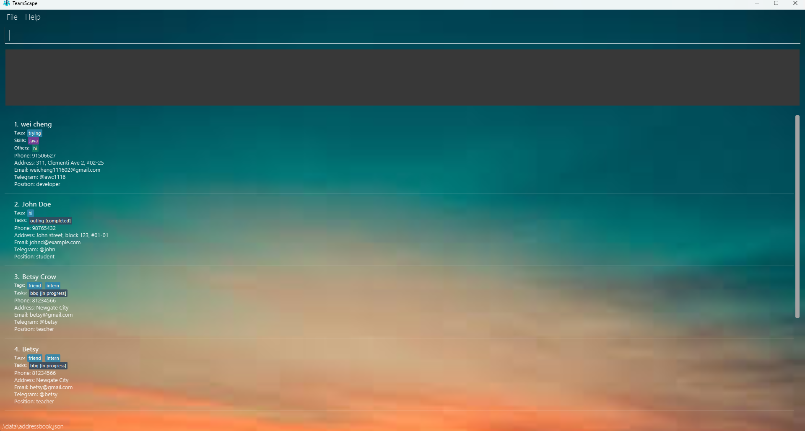

# TeamScape

**TeamScape** is a desktop application for managing your team members, their contact details, and their tasks.  
It is built for team managers who prefer a fast, CLI-first workflow with full offline functionality.

---

## 👨‍💼 What Can It Do?

With TeamScape, you can:

- Add, edit, and search for team members and their details
- Assign tasks with due dates and statuses
- Track progress and generate task reports
- Use intuitive CLI commands with a responsive UI

---

## 🚀 Getting Started

* To start using TeamScape, check out the [_Quick Start_ section of the **User Guide**](UserGuide.html#quick-start).
* To learn how it works under the hood, view the [**Developer Guide**](DeveloperGuide.html).

---

## 🤝 Acknowledgements

* Built on [SE-EDU AddressBook Level-3](https://github.com/se-edu/addressbook-level3)
* Libraries used:
    - [JavaFX](https://openjfx.io/)
    - [Jackson](https://github.com/FasterXML/jackson)
    - [JUnit5](https://github.com/junit-team/junit5)
